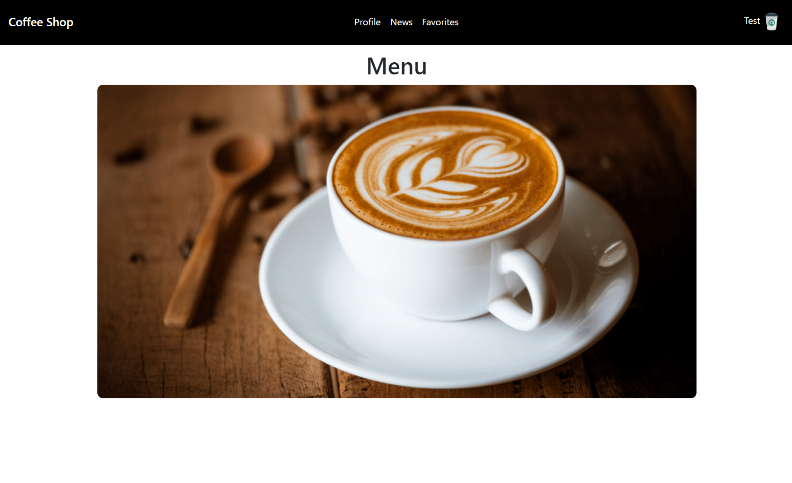
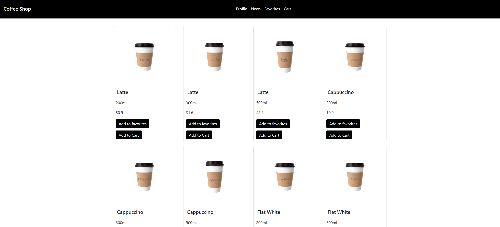
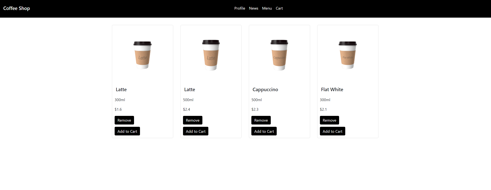
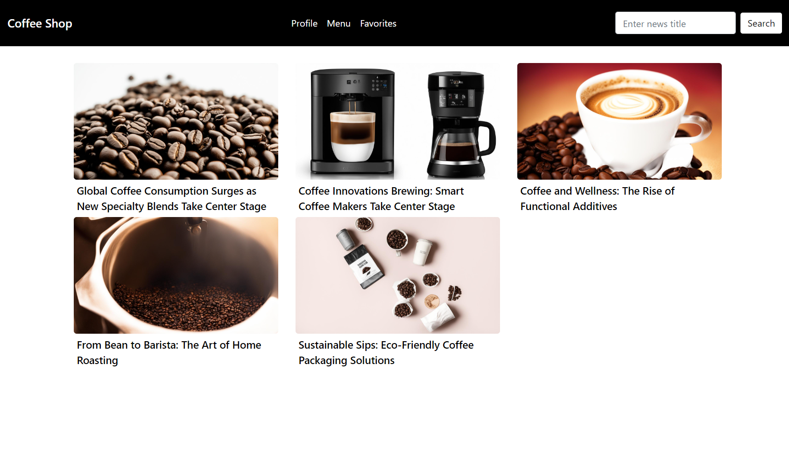
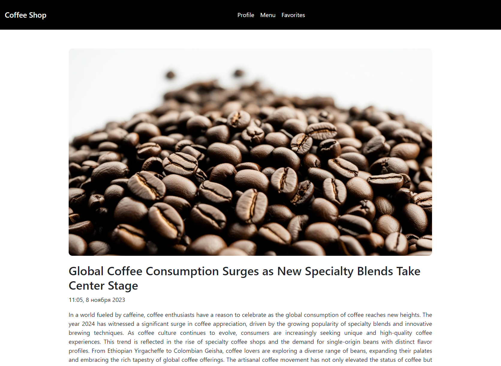
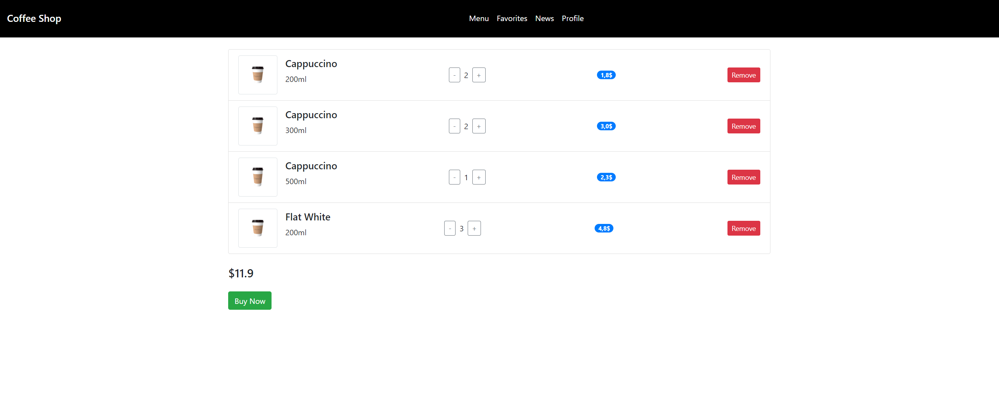
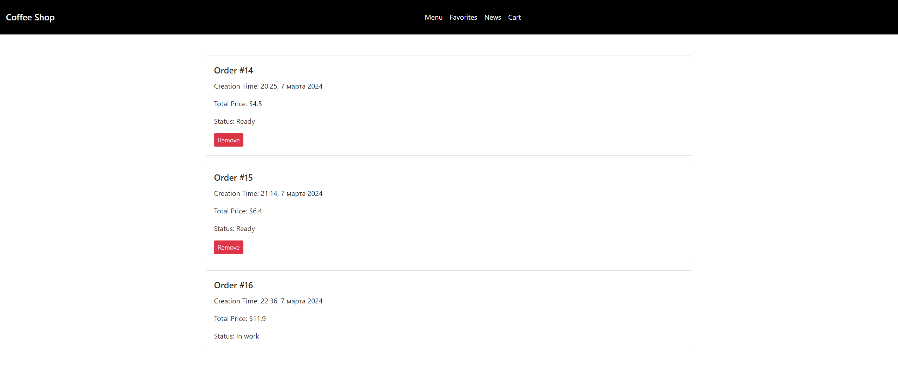

# Coffee shop app

## Overview

A web application of a coffee shop. The features include: 
Authorizing and add an account, which allows the use of general features,
Viewing the menu items, adding them to the favorites for easy access,
Adding items to the cart to buy them later,
Creating an order, viewing all orders and their status,
Reading the news about the coffee shop and coffee related topics.

## Future plans

Now I'm working on porting data model to hibernate,
which you can see in the branch `feature/hibernate`.
Although the application is fully functional, 
there are some additional quality of life changes
that can be made. They include code refactoring, and some optimization.
I also plan to wrap the application in a docker container,
and implement a CI/CD pipeline in the future, 
as will learn those technologies.
Additionally, I plan to port this application to spring,
to compare the two approaches. 
This will also allow me to learn more about spring.
You can find the application in my repository [here](https://github.com/Shimady563/coffee-shop-app-spring)

## Technologies used

For application logic I use Java Servlets.

For data access I use JDBC and Postgres.

For interface I use Bootstrap and Thymeleaf

For test I use Junit and Mockito

I chose servlets and jdbc instead of spring and hibernate
because I wanted to learn more about their work, I think
it helps better understand how spring and hibernate works.
