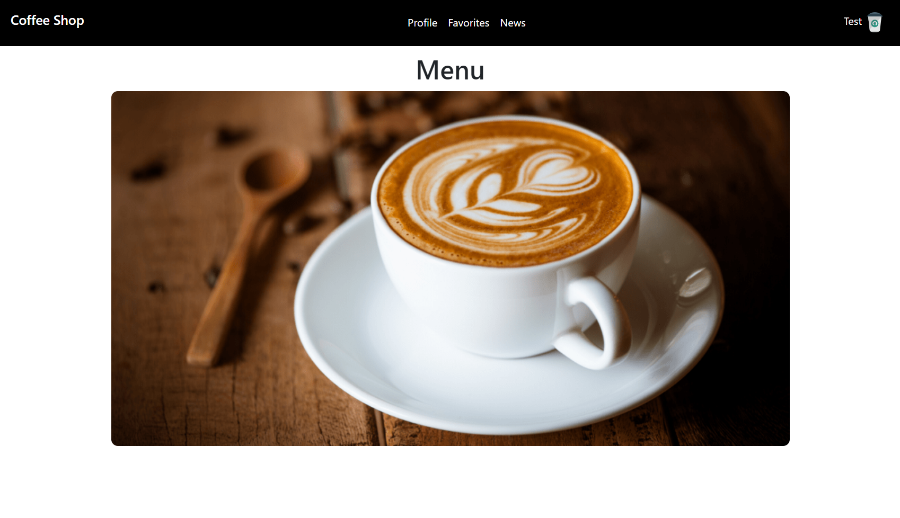
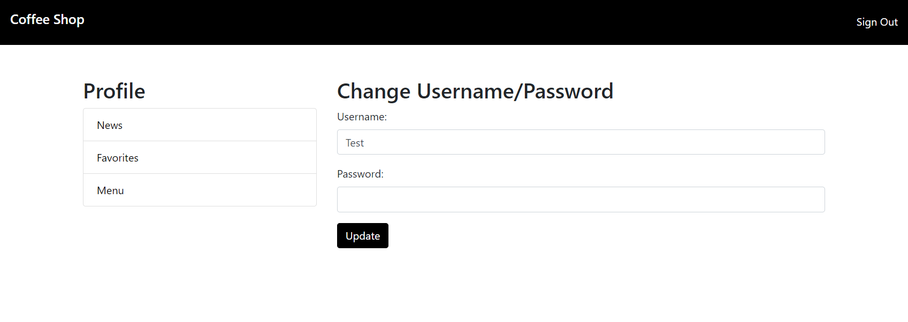

# Coffee shop app

## Overview

A web application of a coffee shop. User can register which allows
to view and change his username and password, view coffee shop menu, 
save preferred menu items to favorites for easy access 
and read the news about the coffee shop and it's offerings.

## Future plans

While i'm working on favorites and news, i also plan to 
implement purchase ability. It will include the ability to add
items to cart and buy them. Also there will be points system, which will
allow users to recieve points for purchases and spend them in the future.

## Technologies used

For application logic I use java servlets.

For data access I use jdbc and postgres. 

For interface I use bootstrap and thymeleaf

I chose servlets and jdbc instead of spring and hibernate
because i wanted to learn more about their work, i think 
it helps better understand how spring and hibernate works.
